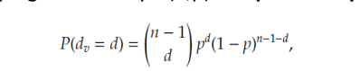
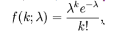
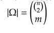
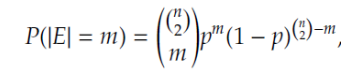
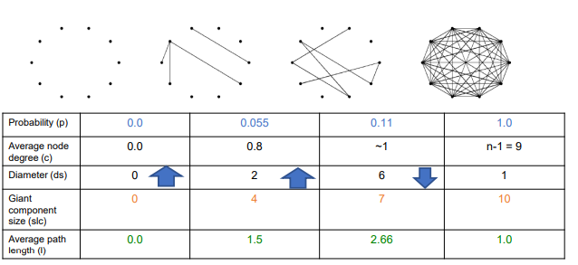
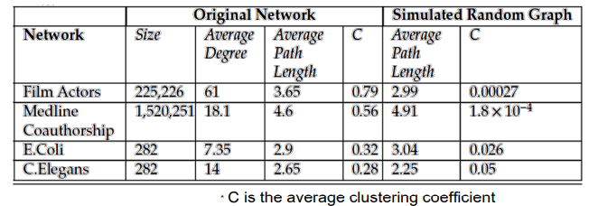
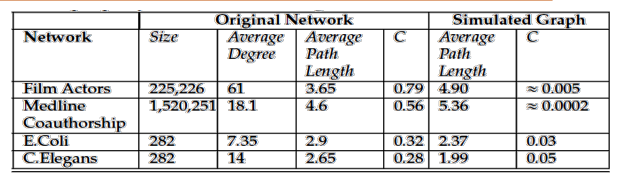

# Unit 4

## Lesson 1: Bottom Up Approach- Clique, N-Clique, K-Clique, K-Clan,K-Plex

- Clique is a complete sub-graph
    - every member is connected to each other
    - any two vertices are adjacent
- Maximal sub-graph - no extra node can be added without disturbing clique property
- Maximum clique - clique with largest number of vertices
- Maximal cliques are np hard problems
- Issues with cliques
    - Above definition is very rigid
- Two approaches to fix this
    - N clique/N-Clan - link between members
    - k-plex/k-core no of members a member is connected with
- N-Clique/ K-clique
    - few members dont know each other
    - path of {u,v} $\lt$= k
    - n=2 means max path between 2 nodes is 2
- K Clan
    - Diameter of graph is $\lt$= k
    - All paths must be through members of the group
- K plex
    - k-plex of size n means each vertex is connected to **at least** n-k other vertices
    - Can be overlapping
- K-core
    - Each node has at least a degree k
        - 0-kore is a full graph with no restrictions
        - 1-kore means every node has at least one edge (there are no isolated nodes)
        - 2-kore ever graph has at least 2 edges (there are no pendulum vertices)
        - **Cannot be overlapping**
    - Finding k-core
        1. Remove all nodes with degree less than k
            - Some nodes may have less neighbours after trimming,  remove them too
        2.  Remaining nodes form the k-core
    - K-crust 
        - What is left of the graph after removing k-core
        - In a k-core, the subgraph where every node has k neighbours is _k-corona_

## Lesson 2: Community detection, Cluster vs. Community

### Clique Percolation Method (CPM)

- Input parameter is a clique of size k and the network

- Steps
    1. Find all cliques of size k in the graph
    2. Create a set of all cliques that have k-1 nodesi n common
    3. Those nodes become communities
- It is computationally expensive so usually a _small value of k is chosen_

- CPM can return **Overlapping Communities**

### Overlapping communities

- Given a value of k find all of the maximal cliques with at least k nodes

- Matrix method - refer to slides

## Lesson 3: Girvan Newman

TBD

## Lesson 5: Generative Models

- It is difficult to analyze real life networks like social media networks because of the complexity of connections and nodes

- In order to make accurate predictions we simulate smaller graphs that are similar to larger graphs

- Empirical Network 
    - Power-law
    - Small average distance (graph diameter)
    - Large clustering coefficient
    - Giant connected component
    - Scale free nature
- Models
    - Random Graph models (Erdos & Renyi)
    - "Small World Model" (Watts & Strogatz)
    - Prefential Attachment Model(Barbasi & Albert)
    - Myopic Search

### Network Properties

- Started with **Bacon number**: nobody in Hollywood is more than 6 hops away from actor Kevin Bacon

- **Erdos number**: Connecting scholars to Erdos. Erdos has 1500+ papers with 507 co-authors

- **Stanley Milgram's Experiment**: People in Nebraska were told to send a letter to a stock broker in Boston. They could only send to someone they knew on a first name basis

- Average path length was _6_

#### Empirical Network

5 characteristics an Empirial Network should have:

1. Giant component
2. Large Local Clustering Coefficient
3. Power Law
4. Scale-free network

- **Giant Components** : There is one large component which covers more than 90% of all nodes. Rest of the network is divided into smaller nodes

- **Large Local Clustering Coefficient**: In real world friendships are highly transitive (A friend of my friend is also my friend)

- **Power Law**
    - Power Law refers to _skewed popularity_
    - Examples of power law
        - Many individuals with few friends, few individuals with thousands of friends
        - Many sites get visited few times a day, few sites get visited millions of times a day
        
        

    - In normal distribution, probability decreases as you move further away from the mean. This is not good for modelling degree distribution

    - In power law Probability (x) = 1/xb

        - Taking log on both sides log(probability(x)) = blog(x) which is a straight line
        - Expressing power law in graph theory, let p(k) denote the fraction of people having degree k (they are connected to k people)
            - pk=ak-b
            - ln pk= -bln k + ln a
            - b is **power-law exponent** usually in the range [2,3]
            - a is the **power law exponent**
        - To check for power law in a graph, take any popularity measure, compute the results and plot the logarithmic equation, if it is a straight line then power-law distribution exists

- **Scale-Free Networks**
    - Scale free networks are those networks with a power-law degree distribution.
    - If you rescale the variable k (k becomes ck where c is some constant) then the network remains unchanged other than that multiplicative factor c
    -Scale free networks have **large hubs**
    - Heavy Tails/ Fat tails: In normal distributions, tails are thin, in scale free networks the tails are heavy meaning that outliers are allowed and in fact expected in these networks
    - Characteristics of Scale-free networks
        1. Degree distribution follows power law
        2. Clustering coefficient decreases as node defree increases (also power law)
        3. Exhibit small world phenomena
        4. Brittle - Can reduce connectivity by removing few nodes
- Pareto Law - 80/20 rule: 20% of causes decide 80% of effects
    - In terms of **CDF** (cumulative distribution frequency)
- Zipf's law - Frequenct of any word is inversely proportional to its rank

## Lesson 6: Random Graph Models

- Assumption: Edges (friendships) between nodes (people) are formed **randomly**
- There are two models (n p) and (n m)
- (n p) model
    - Any of the (n 2) edges are formed randomly
    - Denoted as G(n, p)
    - **Number of edges are not fixed**
    - Expected degree of a node is c=(n-1)p
        - A node can have a maximum degree of n-1
        - Probability of selecting an edge is p
    - Expected number of edges in G(n, p)is nC2p
    - Estimate the probability of a given node having degree d

    

    - As n -> infinity, it becomes a Poisson distribution 
        - lambda = pn 
        
        - **NOTE**: Poisson law decays _exponentially_ while power law decays _polynomially_
- G(n m) model
    - Here m edges are fixed
    - Which m edges of the (n 2) edges should be picked?
    
    - Selection probability 1/Omega
    

- G(n p) vs G(n m)
    - Both models act similar when n is large
    - G(n p) is more likely to contain none or all possible edges
    - G(n m) has fixed number of edges

- Small p
    - Small isolated comonents
    - Small diameter
- Large p
    - Giant component appears
    - isolated components become connected
    - diameter increases
- Very large p
    - Diameter shrinks
    - Point of shrinkage is *phase transition*
    - Happens at p=1/(n-1) 0r c=1
-Local and Global clustering coefficients are **p**

- Is able to model average path lengths
- Underestimates clustering coefficients

- Random graph vs. scale frree netoworks
    - Differ in the tail of the degree distribution
        - Small k: Power law is above Poisson function
        - Moderate k: Poisson distribution is above power law
        - Large k: Power law is above Poisson function
    - Disruption: Random % of nodes removed
        - Monotonic increase in diameter of random graphs
        - Diameter remains almost same in scale-free graphs
    - Attack: % of nodes are removed intentionally 
        - Diameter does not change in random graphs
        - In scale free graphs diamter doubles for every 5% node removal

## Lesson 7: Preferential Attachment Model

- When adding a new node, it is more likely to connect to an existing node with  more number of edges
-Probability of connecting to a node is proportional to its degree
- **Two Ingredients**
    - _Growth Element_: Add nodes as time goes by
    - _Preferential Attachment Model_: Edges are added in a specific way to achieve scale free networks

- Realistic degree distribution
- Small Average Path lengths
- **FAILS** to exhibit high clustering coefficients

## Lesson 8: Small World Model

- In real world people have similar fixed connections (parents, students, siblings)
- Embedding individuals in regular networks
- Builds the network on low dimensional regular lattice
- Example: one dimensional ring lattice